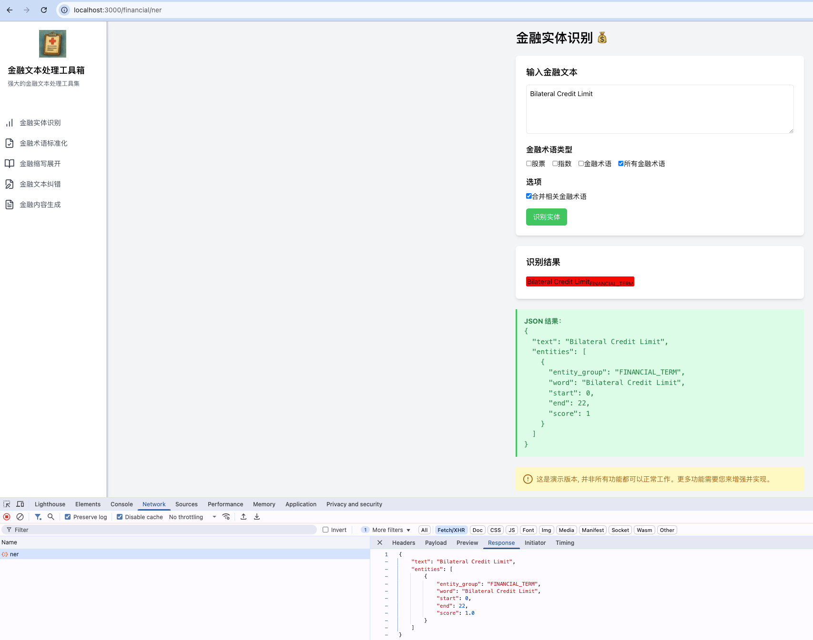
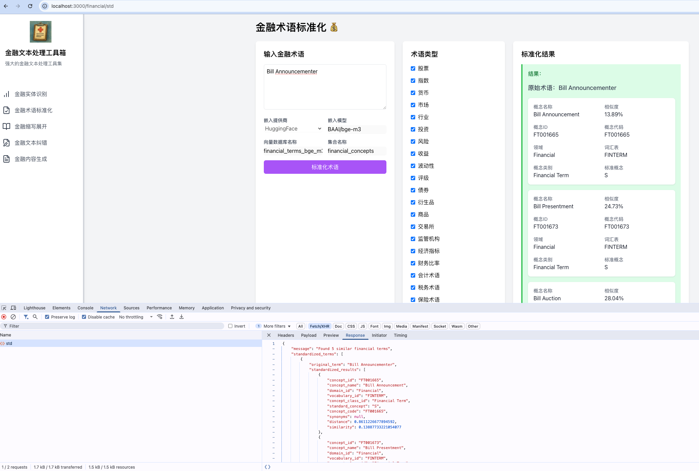

## 开始使用

1. 克隆仓库
将`万条金融标准术语.csv`数据放在项目的backend/data目录下
2. 安装依赖：
   ```bash
   cd frontend
   nvm use v22.14.0
   npm install
   ```
3. 运行开发服务器：
   ```bash
   npm start
   ```
4. 在浏览器中打开 [http://localhost:3000](http://localhost:3000)


5. 后端依赖

```bash
cd backend
conda create -n financial-nlp-box python=3.11
conda activate financial-nlp-box
pip install -r requirements_mac_no_GPU.txt
```

6. 数据初始化
```bash
python tools/create_financial_terms_db.py 
```
执行成功后,会在项目的backend/db下出现db文件:`financial_terms_bge_m3.db`

7. 使用本地下载的 HuggingFace 模型
* 设置 HuggingFace 本地模型文件目录 `HF_MODEL_PATH` 环境变量：

```shell
export HF_MODEL_PATH="/Users/zhangwufei/hf_model_path"
export HF_ENDPOINT=https://hf-mirror.com
```

* 下载 HuggingFace 模型，以 `dslim/bert-base-NER` 为例：

```shell
# 创建 HF_MODEL_PATH 目录
mkdir -p /Users/zhangwufei/hf_model_path
export HF_MODEL_PATH="/Users/zhangwufei/hf_model_path"

cd $HF_MODEL_PATH

# 获取 HuggingFace 模型下载脚本
wget https://hf-mirror.com/hfd/hfd.sh
chmod u+x hfd.sh

# 下载 dslim/bert-base-NER 模型文件
mkdir -p dslim/bert-base-NER
./hfd.sh dslim/bert-base-NER --tool wget -x 4 -j 1 --local-dir dslim/bert-base-NER
# 下载 BAAI/bge-m3 模型文件
mkdir -p BAAI/bge-m3
./hfd.sh BAAI/bge-m3 --tool wget -x 4 -j 1 --local-dir BAAI/bge-m3
```

8. 配置 OpenAI API Key

根据你使用的命令行工具，在 `~/.bashrc` 或 `~/.zshrc` 中配置 `OPENAI_API_KEY` 环境变量：

```shell
export DEEPSEEK_API_KEY="xxxx"
```

9. 启动后端

上述开发环境安装完成后，使用`uvicorn`启动后端

```shell
# 进入后端代码目录
cd backend/
# 启动
uvicorn main:app --reload --port 8000 --host 127.0.0.1
```

### 项目演示
#### NER

#### STD

